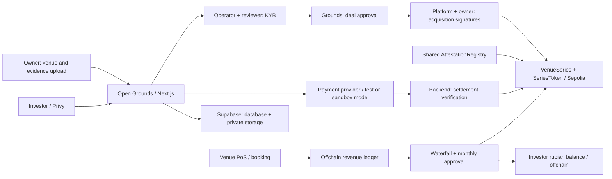

<div align="center">
  

  # Open Grounds

  **Real yield from real sports venues: profit-sharing tokens where the chain is the referee, not just the ledger.**

  [Live platform](https://opengrounds-ten.vercel.app/) · [Live PoS](https://opengrounds-pos.vercel.app/)
</div>

---

> **TL;DR:** A sports venue that owns its land sells a share of its **net profit rights** to an SPV
> called **Grounds**, which issues tokens to small investors. Rupiah stays offchain through a payment
> gateway. The **rules** run onchain: contracts recompute the monthly waterfall, check signatures,
> amounts, and cost caps, and require 2-of-3 EIP-712 approvals for key decisions. Revenue data comes
> from the venue's own PoS cashier.
>
> **Hackathon prototype on Ethereum Sepolia.** Rupiah flows, escrow, and the rights acquisition are
> simulated; tokens are not backed by venue assets; Open Grounds is not licensed.

## Contents

[Problem](#the-problem) · [Solution](#our-solution) · [How It Works](#how-it-works) · [Features](#features) · [Standards](#standards) · [Architecture](#architecture) · [Economics](#economics) · [Repository Structure](#repository-structure) · [App Pages](#app-pages) · [Getting Started](#getting-started) · [Deployed Contracts](#deployed-contracts-sepolia) · [Testing & Security](#testing--security) · [Who It's For](#who-its-for) · [Current Limitations](#current-limitations) · [Roadmap](#roadmap) · [Hackathon Notes](#hackathon-notes) · [Tech Stack](#tech-stack)

## The Problem

| Pain point | What it means for people |
|---|---|
| **Capital bottleneck** | Venue owners with busy courts struggle to fund new locations. Bank loans are slow and rigid and demand heavy collateral, and the alternative is selling equity. |
| **Locked-out investors** | Retail investors want yield from real businesses, but private commercial assets sit behind high minimum tickets and exclusive syndicates. |
| **Black-box reporting** | Monthly reports are easy to manipulate, profit calculations are opaque, and investors cannot verify whether costs were padded to shrink their share. |
| **Cash leakage** | Cash that never touches a traceable channel never shows up in the numbers. |
| **Central control** | When one party holds both the database and the keys, that party can quietly change the records. |

## Our Solution

An owner sells **X% of the economic rights to distributable net profit** to the SPV **Grounds**, paid upfront (simulated). Grounds mints the token supply **once** to a treasury and sells it on an ongoing basis to small investors. Each month, a waterfall

`gross revenue − refunds − costs − tax − operator fee − reserve − platform fee`

produces a **payout per token** credited to investor balances.

| Problem | How Open Grounds solves it |
|---|---|
| Capital bottleneck | The owner gets paid upfront without debt or giving up land or operations, and keeps the remaining (1−X)% of profit plus an operator fee. |
| Locked-out investors | Tokens start at a Rp10,000 demo default price (about $1), paid through a payment gateway. Investors sign in with email through Privy: no seed phrase, no gas. |
| Black-box reporting | The PoS keeps an append-only ledger. The contract recomputes the waterfall, rejects deductions above gross, and caps operating costs. |
| Cash leakage | Target: at least 90% of revenue through digital channels, with every payment split at the source. |
| Central control | Key decisions need two distinct signers (2-of-3, EIP-712), and **investors sign their own orders**. |

**The chain checks rules over submitted data; it does not read bank accounts.** `paymentEvidence` is a hash, not a payment oracle, and the truth of rupiah settlement still depends on the payment provider and backend. See [Current Limitations](#current-limitations).

**AI is advisory only:** document extraction, cross-checks, reconciliation, and risk indicators. AI cannot approve, mint tokens, or move funds, and every finding needs human review.

## How It Works

```
Owner submits ─▶ KYB review ─▶ SPV deal + signatures ─▶ Series activated ─▶ Investor signs order + pays
   ─▶ Token allocated (locked lot) ─▶ Monthly: PoS revenue ─▶ Waterfall ─▶ Approved figures ─▶ Payout per token
   ─▶ Investor balance ─▶ Withdraw / reinvest / sell back
```

1. **Submit.** The owner uploads the venue, legal entity, land, and financial history. Target criteria: land owned and unencumbered, at least 12 months of history, at least 90% digital revenue, KYB passed including signatories and beneficial owners of 25% or more.
2. **Review.** An operator and an independent reviewer approve the KYB snapshot (two different wallets), and the series contract is deployed. No token exists yet.
3. **Acquire.** Grounds approves the deal, PLATFORM and the owner sign the acquisition, and supply is minted **once** to the treasury. The upfront payment is simulated.
4. **Buy.** The investor completes KYC with an own-name bank account, signs an order, and pays in rupiah. The backend verifies provider status, then calls `allocate`. Each allocation forms a locked lot.
5. **Operate.** Booking payments enter the PoS ledger. A daily s% split goes to the SPV pocket as temporary accumulation, then month-end reconciliation and true-up settle the real figure.
6. **Distribute.** The owner signs the monthly profit figure (or the verifier steps in), the contract computes payouts and obligations, and the platform records `settlePayout`. Funds enter the investor's offchain ledger balance.
7. **Exit.** Investors withdraw, reinvest, or request a FIFO sell-back to the treasury once their lot unlocks. Liquidity is not guaranteed.

### Who approves what

| Decision | Who must approve |
|---|---|
| Token issuance (acquisition) | Platform + Owner |
| Monthly profit figure | Platform + Owner, or Platform + Verifier after the owner's deadline (mismatched figures → dispute) |
| Revaluation | Platform + Verifier |
| Buy / sell-back | The investor signs their own order (Privy wallet) |

"2-of-3" does not mean any pair may approve every decision.

## Features

- **Referee, not a database:** bookings stay offchain in the PoS; the chain enforces economics and signature quorums.
- **Contract-recomputed waterfall:** the contract recomputes the waterfall and payout accumulator instead of accepting a final figure, and enforces an operating-cost ceiling.
- **Tripartite approvals:** three separate EIP-712 signature domains (KYB review, registry attestation, investor orders) so one kind of approval cannot be replayed as another.
- **Restricted token:** no peer-to-peer transfers, allowlisted holders, per-address freeze, and locked FIFO lots (max 32 per address).
- **Gasless investors:** Privy embedded wallets; the backend relayer pays execution gas.
- **Order integrity:** the controller cannot allocate without the investor's signature, change an order amount, reuse an order, or pay beyond the recorded obligation.
- **Lifecycle state machine:** Disputed, Overdue, Defaulted, and Liquidating states handle failure paths onchain.
- **AI-assisted KYB:** four advisory agents (document extraction, cross-document checks, reconciliation anomalies, risk indicators) with `source_refs`; facts without evidence are marked UNVERIFIED.
- **Pull-style payouts:** a rupiah × 1e18 accumulator with round-down; dust carries to the next period.

## Standards

| Standard / mechanism | Role in Open Grounds | Limits |
|---|---|---|
| **ERC-20 base** (OpenZeppelin) | Balances, supply, metadata, events; `decimals() = 0` | `transfer`, `transferFrom`, and `approve` **always revert**. Movement happens only through `VenueSeries`. An *ERC-20-based token with restricted operations*, not full ERC-20 semantics, and no automatic DEX integration |
| **ERC-3643-inspired features** | `isVerified` allowlist, `canTransfer` with reason codes, freeze, forced transfer | **Not full ERC-3643**: no identity registry or claim issuer. No claim of certification or regulatory compliance |
| **EIP-712** | Investor orders, sell-back, attestations, KYB review | Typed data with a separate domain per approval type. Replay is prevented by IDs, deadlines, and usage tracking, **not by EIP-712 itself** |
| **OpenZeppelin AccessControl + ReentrancyGuard** | Roles and balance guards | Reused components, not evidence of an audit |

**Not used:** ERC-721/1155 (units in a series are interchangeable), ERC-4626 (money flows in offchain rupiah, not as onchain assets), ERC-1271, ERC-2612. Signatures are verified via ECDSA.

## Architecture



### Contracts

| Contract | Responsibility |
|---|---|
| [`AttestationRegistry`](packages/contracts/src/AttestationRegistry.sol) | PLATFORM, COUNTERPARTY (owner per series), and VERIFIER slots; checks signature pairs per decision, deadlines, and `(kind, series, refId)` anti-replay. Platform/verifier rotation has a one-day delay |
| [`VenueSeries`](packages/contracts/src/VenueSeries.sol) | State machine, activation, allocation from investor orders, sell-back, waterfall, payout accumulator, settlement recording, disputes, Overdue/Defaulted, revaluation, liquidation |
| [`SeriesToken`](packages/contracts/src/SeriesToken.sol) | Restricted fungible balances, supply minted once to the treasury, allowlist/freeze, FIFO lots |

### Lifecycle

```text
Draft → Verified → Active ⇄ Disputed
                    │
                    └→ Overdue → Active or Defaulted
                                             └→ Active or Liquidating
Active → Liquidating → Closed
```

| # | Who | Action |
|---|---|---|
| 1 | Operator + Reviewer | Sign the KYB snapshot (offchain); series contract deployed |
| 2 | Grounds / SPV | Approves the acquisition deal (offchain back office) |
| 3 | Platform + Owner | Sign the acquisition attestation; `activate` mints supply once to the treasury |
| 4 | Investor | Signs an `Order` and pays; controller calls `allocate` after the provider confirms |
| 5 | Platform + Owner (or Verifier) | Sign the monthly figures; the contract computes the waterfall and payouts |
| 6 | Platform | Records `settlePayout`; investor offchain balance is credited |
| 7 | Investor | Withdraws, reinvests, or signs a `SellBack` (FIFO queue, available reserve) |
| 8 | Platform + Verifier | Sign a revaluation when the reference price changes |

### Onchain vs offchain

| Onchain | Offchain |
|---|---|
| Token balances, fixed supply, treasury, allowlist, freeze, locked lots | Identity, KYC/KYB, land certificates, financial documents, bank accounts |
| Verified signatures, used order IDs, evidence hashes, events | Booking ↔ payment ↔ bank evidence, document storage, staff audit |
| Reference price, waterfall figures, payout accumulator, period obligations | Rupiah payments, escrow, daily split, true-up, ledger balances, withdraw/reinvest |
| Dispute status, Overdue/Defaulted, liquidation | Legal review, asset appraisal, real-world enforcement and collection |

Wallets and token balances may be public. Documents and personal identity are never written onchain ([`dataPolicy.ts`](packages/shared/src/dataPolicy.ts)).

### Roles

| Actor | Authority |
|---|---|
| Owner | Uploads venue/documents, offers X%, signs acquisition and monthly profit (Privy wallet) |
| Investor | KYC + own-name bank account, signs buy/sell-back orders, withdraws/reinvests |
| Operator | Internal review, platform operations, reports, relayer |
| Reviewer | Independent KYB review with MetaMask; the VERIFIER slot requires a registry wallet |
| Grounds/SPV | Acquisition deal, purchase capital, treasury, reserves |
| Backend/controller | Executes transactions, allowlist/freeze, payout recording, forced transfer; a trusted component |
| Admin | Series registration, roles, administrative actions. Production target: multisig |

## Economics

Source: [`economics.ts`](packages/shared/src/economics.ts) and `/cara-kerja`. The contract recomputes the same figures.

```text
V = min(V_asset, D12 / r)          S = V × X
N = S / p                        p_ref = V × X / N
D = max(0, gross − refund − opex − tax − operator_fee − venue_reserve − platform_fee)
P_SPV = D × X                    F_spv = P_SPV × m
P_investor = P_SPV − F_spv        P_owner = D × (1 − X) + operator_fee
```

`D12` comes from revenue that passed reconciliation; venue assets are a valuation reference, **not collateral for the token**. Losses do not carry forward.

| Parameter | Demo value / status |
|---|---|
| r (required yield) | 9% **[Assumption]**, a valuation input, not a promised return |
| Initial price p | Rp10,000 **[Assumption]** default; can be set per venue |
| Platform fee | Code default 3% of gross, demo placeholder; production rate **[Open]** |
| SPV management fee m | 2% **[Assumption]** of P_SPV |
| Daily split s | 12% **[Assumption]**, then true-up |
| Yield sanity band | 5–20% **[Assumption]**; outside the band is flagged to the reviewer |
| Opex cap | 80% of gross **[Assumption]** |
| Lot lock | 10 minutes (demo mode); model target 6 months **[Assumption]** |
| Overdue / Defaulted | 7-day deadline / 14-day tolerance **[Assumption]** |
| Monthly owner signature window | 3 days **[Assumption]** |

## Repository Structure

```
.
├── apps/
│   ├── platform/            # Next.js: catalog, portfolio, owner portal, KYB review, operator, verifier, SPV back office
│   └── pos/                 # Venue OS / PoS: bookings, gateway invoices, settlement, append-only ledger
├── packages/
│   ├── contracts/           # Foundry: AttestationRegistry, VenueSeries, SeriesToken
│   ├── shared/              # Owner schema, economics formulas, disclosures, data policy
│   ├── verification/        # KYB gate, extraction, cross-checks, reconciliation (advisory)
│   ├── connectors/          # Booking/report interfaces
│   └── ui/                  # Design system
├── pitch-deck/              # Separate Vite app for the pitch (not part of the backend)
├── scripts/                 # deploy.sh, setup-operator.sh, gen-abi.mjs
└── docs/                    # Earlier-iteration docs (see note below)
```

> `docs/PRD.md`, `docs/PLAN.md`, `docs/SETUP.md`, `docs/CONTRACTS.md`, and `docs/OPEN-DECISIONS.md` hold context from earlier iterations and are not fully aligned with the v4.1 model (e.g. minimum raise/refund, tenor, the old signer scheme). For current behavior, prioritize the linked source, the local PRD v4.1, and the latest decisions in `AGENTS.md`.

## App Pages

| Page | For | What it does |
|---|---|---|
| `/owner/apply` | Owners | Upload venue and documents, offer X% |
| `/spv` | Grounds / SPV | Review and approve acquisition deals |
| `/staff` | Operator | Invite reviewers and SPV accounts, platform operations |
| `/cara-kerja` | Everyone | How it works and the formulas |
| `/kebijakan-data` | Everyone | Data policy catalog: what is stored where |
| PoS (:3001) | Venues | Bookings, gateway invoices, settlement, ledger, reports |

## Getting Started

### Prerequisites

- Node ≥ 22, pnpm ≥ 10, Foundry
- A Supabase account and a Privy account
- A testnet wallet with Sepolia ETH, and MetaMask (for the verifier wallet)

### 1. Install and build contracts

```bash
cp .env.example .env     # one root .env for all apps, scripts, and Foundry
pnpm install
cd packages/contracts \
  && forge install OpenZeppelin/openzeppelin-contracts@v5.1.0 --no-git \
  && forge install foundry-rs/forge-std --no-git \
  && forge build && cd ../..
node scripts/gen-abi.mjs   # ABI + bytecode into apps/platform/lib/abi.ts
```

### 2. Database

The app needs the Supabase `pos` and `platform` schemas with RLS/storage. The `db/00–03` migrations mentioned in older docs are **not present** in this checkout; get the matching migrations from the maintainer. `pnpm install` does not create the schema. `reset:storage` wipes bucket contents; use it only to deliberately reset demo data.

### 3. Wallets, contracts, and staff

1. **Wallets.** Deployer (`cast wallet import deployer --interactive`), an independent **verifier** wallet (`ATTESTOR_VERIFIER_ADDRESS`), and the operator (`./scripts/setup-operator.sh`). Owners use their own Privy wallets.
2. **Contracts.** `./scripts/deploy.sh` deploys `AttestationRegistry` once. `VenueSeries` + token are deployed automatically per venue after the KYB quorum. Tokens are not minted until the SPV deal and owner acquisition are complete.
3. **Staff.** `pnpm --filter @venue-rwa/platform staff:create` (first operator), then invite a **reviewer** (VERIFIER) and an **SPV** account via `/staff`.

### 4. Configure and run

Key `.env` variables (some providers have simulated fallbacks; Supabase, RPC/registry, and Privy are still required for the full flow):

| Variable | Purpose |
|---|---|
| `PSP_MODE=xendit` + `XENDIT_SECRET_KEY` | Investor purchases via Xendit test mode |
| `NEXT_PUBLIC_PRIVY_APP_ID` | Investor/owner wallets; Supabase custom-auth JWT, JWKS `…/auth/v1/.well-known/jwks.json` |
| `LLM_*` | OpenAI-compatible gateway (Morphic) for document extraction |
| `DIDIT_*` | KYC provider path |
| `INTERNAL_API_TOKEN` | PoS → platform and sandbox webhook HMAC |

```bash
pnpm dev:pos        # :3001
pnpm dev:platform   # :3000
```

### 5. Seed demo data

```bash
pnpm --filter @venue-rwa/platform seed:demo -- --variant=futsal   # or padel, tenis
```

Adds a synthetic submission to owner `kopiKenangan@gmail.com`, PDF/CSV documents, labeled external reference photos, a synthetic PoS workspace, and 12 sandbox payments (initial token price Rp5,000 / Rp10,000 / Rp25,000). Run once per variant. It does not contact a real bank or gateway; payment rows are `simulated=true`. Operator, reviewer, and owner approvals still use their own wallets. Photo credits: `apps/platform/lib/demo-photos.ts`.

<details>
<summary>Advanced seeds: Active venue, profit, and investor test balance</summary>

- **Already-Active Kenangan venue:** `pnpm --filter @venue-rwa/platform exec tsx --env-file=../../.env scripts/seed-active-profit.ts` fills sandbox payments and costs without wiping the ledger. Add `--close` once the last settlement is at least 60 seconds old to prepare the report: owner signs → settle the sandbox true-up if asked → investor balance credited → investor chooses reinvest or withdraw. No profit is credited before approval; the seed never signs as investor or owner.
- **Investor test balance:** run `scripts/seed-investor-balance.ts` via tsx with the root `.env`. Non-production Sepolia only; pass `--user=<id>` if there is more than one investor. A one-time Rp100,000 credit is recorded as an `adjustment` labeled test balance (not `distribution` / PAYOUT_SETTLED); repeating reuses the same ref so it never credits twice.

</details>

### Demo walkthrough

1. Owner uploads venue and documents → automated checks and AI findings
2. Operator and reviewer sign the approval → series contract deployed
3. SPV approves the deal → platform signs → owner signs the acquisition (simulated) → tokens minted to treasury
4. Investor KYC, bank account, order signature, payment → tokens arrive (lot locked for 10 minutes in demo mode)
5. Bookings in the PoS (s% split) → operator closes the period → owner signs the figures
6. Contract computes payouts → true-up → investor balance → withdraw / reinvest / sell back
7. Operator page: **"cheating platform rejected"** (the contract rejects a deviating figure) and the **Overdue** state

## Deployed Contracts (Sepolia)

| Item | Value |
|---|---|
| Network | Ethereum Sepolia |
| `AttestationRegistry` | TODO: address + Etherscan link |
| Example `VenueSeries` / `SeriesToken` | TODO: address + Etherscan link |
| Address source | `packages/contracts/deployments/latest.json` |
| Live platform | https://opengrounds-ten.vercel.app/ |
| Live PoS | https://opengrounds-pos.vercel.app/ |

Payments run in **Xendit test mode** or a sandbox mock. Rupiah balances in the demo are not real bank funds.

## Testing & Security

```bash
pnpm test:contracts
pnpm --filter @venue-rwa/shared test
pnpm --filter @venue-rwa/verification test
pnpm --filter @venue-rwa/platform test
pnpm --filter @venue-rwa/platform typecheck
pnpm --filter @venue-rwa/platform build
pnpm --filter @venue-rwa/pos selftest
```

- Contract tests cover fixed supply, balance conservation, locked lots, order replay, wrong amounts, transfer restrictions, cost cap, period posting, signatures, and the accumulator. Invariant tests include `invariant_supplyFixed`, `invariant_balancesSumToSupply`, and `invariant_poolConservation`, with regression suites for earlier findings.
- Platform tests cover owner-bound submissions, the SPV deal gate, and KYC session/redirects.
- Latest check, 10 October 2026: platform build, typecheck, and 18 platform tests pass. Use the command output at the commit you test, since counts change.
- No proxy or upgradeability, but admin/controller roles, registry signers, and the allowlist are still managed (the demo series uses the backend wallet for admin + controller). **No proxy does not mean no administration.**
- Build: Solidity `^0.8.24`, `solc 0.8.28`, Cancun, optimizer + `via_ir` ([`foundry.toml`](packages/contracts/foundry.toml)); OpenZeppelin v5.1.0.

> ⚠️ This code has not been independently audited, and passing unit, invariant, and build checks is not proof of bank settlement. Do not use it with real funds.

## Who It's For

- **Venue owners** who want upfront capital without debt, collateral, or selling the business.
- **Retail investors** who want a small-ticket share of real operating cash flow, with rules they can verify.
- **Independent reviewers and verifiers** who sign off on evidence and figures with their own wallet.
- **Venue operators** who already run bookings and payments and want that data to carry weight.

## Current Limitations

This is a hackathon prototype on a testnet. We are explicit about what is simplified or not yet proven:

- **Rights and regulation:** the token represents an economic-benefit-rights model, not land, PT shares, or a sukuk. **It is not backed by venue assets.** Open Grounds is unlicensed; legal form and the rights-transfer contract are not final. Returns and liquidity are not guaranteed.
- **Real-world data:** review, valuation, and reconciliation depend on the evidence obtained. AHU/OSS are not integrated. The chain does not prove legal rights, bank statements, or that an asset exists.
- **Money is simulated:** upfront acquisition, rupiah, split, escrow, and distribution. A test-mode API is not bank escrow or a production custodian.
- **Governance:** if operator and SPV are run by the same team, app-level role separation does not prove organizational independence, and two different addresses are not two independent parties.
- **Availability:** the backend is required for orders, provider, reports, and payouts. Investors cannot withdraw rupiah directly from the contract if the backend stops.
- **Verification:** no independent security audit, no complete end-to-end run (web → provider → Sepolia → distribution) declared verified, and no reproducible SQL migrations in this checkout. A `chain:e2e` script exists but needs a ready environment.

## Roadmap

- [x] Three contracts: `AttestationRegistry`, `VenueSeries`, `SeriesToken`
- [x] 2-of-3 EIP-712 approvals with separate signature domains
- [x] Investor and owner web portal, plus an append-only PoS ledger
- [x] AI-assisted KYB pipeline (advisory only)
- [x] Gasless investor flow with Privy embedded wallets
- [ ] Commit reproducible SQL migrations for the `pos` and `platform` schemas
- [ ] Verify the full end-to-end flow on Sepolia
- [ ] Licensed payment provider, escrow, and custodian for production
- [ ] Independent appraisal and AHU/OSS integration
- [ ] Multisig governance and production forced-transfer procedures
- [ ] Legal structure, licensing, and an independent smart contract audit

## Hackathon Notes

Built for the Ethereum Jakarta Hackathon 2026 (RWA track).

**What's new in this hackathon:** all of `packages/contracts`, `apps/platform`, `packages/shared`, `packages/verification`, database schema changes (migration files not yet in this checkout), and this README (see commit history).

**From this project's earlier iteration** (created in this repo before the pivot to PRD v4.1; no code from the older Arbitrum project): `apps/pos`, `packages/connectors`, `packages/ui`.

**Third-party libraries and services:** OpenZeppelin Contracts v5, forge-std, viem, Next.js, React, Supabase, Privy, Xendit (test mode), Didit, Morphic (LLM gateway), unpdf, tesseract.js, three.js / react-three-fiber, zod.

**Design credits:** Lucide icons, a curved gallery from the user's brief, and design references from Rana Grounds and Alsager Padel ([`LANDING_DESIGN.md`](apps/platform/LANDING_DESIGN.md)). The `SpotlightCard` component is from React Bits ([`REACT_BITS_NOTICE.md`](apps/platform/components/ui/REACT_BITS_NOTICE.md)).

## Tech Stack

**Contracts:** Solidity `^0.8.24`, Foundry, OpenZeppelin Contracts v5
**Web3 & wallets:** viem, EIP-712 typed data, Privy embedded wallets, MetaMask
**Frontend:** Next.js 16, React 19, Tailwind CSS, TypeScript, three.js / react-three-fiber
**Backend & data:** Supabase (Postgres, RLS, Auth, Storage), Node.js, pnpm workspaces
**AI & verification:** OpenAI-compatible gateway (Morphic), unpdf, tesseract.js, zod
**Payments & identity:** Xendit (test mode), Didit KYC

---

Built for ETHJKT 2026.