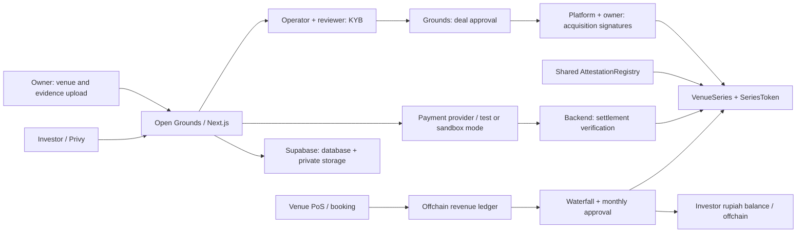

<div align="center">
  

  # Open Grounds

  **Co-own the net profit of sports venues, onchain. The chain is the referee, not just the ledger.**

  [Live demo](TODO) · [Demo video](TODO) · [Pitch deck](pitch-deck) · [Contracts on explorer](TODO)
</div>

> **Honest status:** this is a hackathon prototype. Rupiah flows, escrow, and the rights acquisition are **simulated**; tokens are **not backed by venue assets**; Open Grounds is **not licensed**. Details in [Honest limits](#honest-limits).

## Problem

Sports venues (futsal, padel, tennis) that own their land have steady digital cash flow, but owners struggle to raise capital without pledging the land or selling equity. Small investors have no access to that cash flow, and rarely any way to verify reported profit.

## Solution

An owner sells **X% of the economic rights to distributable net profit** to an SPV called **Grounds**, paid upfront (simulated). Grounds mints the token supply **once** to a treasury, then sells it on an ongoing basis to small investors through a payment gateway. Each month, a waterfall

`gross revenue − refunds − costs − tax − operator fee − reserve − platform fee`

produces a **payout per token** credited to investor balances.

**What's different:** reported profit isn't taken on trust. The contract recomputes the waterfall and checks amounts, signatures, cost caps, and obligations. Key decisions need two distinct parties (EIP-712), and investors sign their own orders.

| Decision | Who must approve |
|---|---|
| Token issuance (acquisition) | Platform + Owner |
| Monthly profit figure | Platform + Owner (Verifier replaces a silent owner; mismatched figures → dispute) |
| Revaluation | Platform + Verifier |
| Buy / sell-back | Investor signs their own order (Privy) |

**AI is advisory only:** document extraction, cross-checks, reconciliation, risk indicators. AI cannot approve, mint tokens, or move funds; every finding requires human review.

## 2-minute demo

1. Owner uploads venue + documents → automated checks and AI findings
2. Operator + reviewer sign off KYB → series contract deployed
3. SPV approves the deal → platform and owner sign the acquisition → tokens minted to treasury
4. Investor completes KYC, signs an order, pays → tokens arrive (locked lot)
5. Bookings flow into the PoS → operator closes the period → owner signs the profit figure
6. Contract computes payouts → investor balance → withdraw / reinvest / sell back
7. Operator page: **"cheating platform rejected"** (the contract rejects a deviating figure) and the **Overdue** state

> TODO before submitting: fill in the demo/video links above and the contract addresses in [Deployment](#deployment).

## Deployment

| Item | Value |
|---|---|
| Network | TODO: **Arbitrum Sepolia** (state the network actually used; the hackathon requires Arbitrum) |
| `AttestationRegistry` | TODO: address + explorer link |
| Example `VenueSeries` / `SeriesToken` | TODO: address + explorer link |
| Address source | `packages/contracts/deployments/latest.json` |

## Architecture

Open Grounds is the platform; **Grounds** is the SPV that buys the rights and issues the token. Owners run venues and submit their own documents. KYB review is done by an operator together with an independent reviewer; SPV deal approval does not replace that review.



| Component | Role |
|---|---|
| [`apps/pos`](apps/pos) (:3001) | Venue OS / PoS: bookings, gateway invoices, settlement, append-only ledger, reports. `company_id` comes from the session, never client input |
| [`apps/platform`](apps/platform) (:3000) | Catalog, portfolio, owner portal, KYB review, operator, verifier, SPV back office; backend submits transactions with viem |
| [`packages/contracts`](packages/contracts/src) | One shared registry, one `VenueSeries` + `SeriesToken` per venue series |
| [`packages/shared`](packages/shared) | Owner schema, economics formulas, disclosures, `/kebijakan-data` data catalog |
| [`packages/verification`](packages/verification) | KYB gate, extraction, cross-checks, reconciliation (advisory) |
| [`packages/connectors`](packages/connectors) · [`packages/ui`](packages/ui) | Booking/report interfaces · design system |
| [`pitch-deck`](pitch-deck) | Separate Vite app for the pitch; not part of the investment backend |

### Onchain vs offchain

| Onchain | Offchain |
|---|---|
| Token balances, fixed supply, treasury, allowlist, freeze, locked lots | Identity, KYC/KYB, land certificates, financial documents, bank accounts |
| Verified signatures, used order IDs, evidence hashes, events | Booking ↔ payment ↔ bank evidence, document storage, staff audit |
| Reference price, waterfall figures, payout accumulator, period obligations | Rupiah payments, escrow, daily split, true-up, ledger balances, withdraw/reinvest |
| Dispute status, Overdue/Defaulted, liquidation | Legal review, asset appraisal, real-world enforcement and collection |

**The chain checks rules over submitted data; it does not read bank accounts.** `paymentEvidence` is a hash, not a payment oracle. The contract checks `paidIdr == tokens × refPrice`, the investor signature, and allocation rules, but the truth of rupiah settlement still depends on the provider and backend. `settlePayout` caps the amount against the obligation but does not prove the bank actually transferred money. Hashes bind evidence so changes are detectable; they do not prove a document is true or that a legal right has transferred.

Wallets and token balances may be publicly visible. Documents and personal identity are never written onchain ([`dataPolicy.ts`](packages/shared/src/dataPolicy.ts)). Redacting data for AI reduces exposure; it does not guarantee anonymity.

## Contracts

| Contract | Responsibility |
|---|---|
| [`AttestationRegistry`](packages/contracts/src/AttestationRegistry.sol) | PLATFORM, COUNTERPARTY (owner per series), and VERIFIER slots; checks signature pairs per decision type, deadlines, and `(kind, series, refId)` anti-replay. Platform/verifier rotation has a one-day delay |
| [`VenueSeries`](packages/contracts/src/VenueSeries.sol) | State machine, activation, allocation from investor orders, sell-back, waterfall, payout accumulator, settlement recording, disputes, Overdue/Defaulted, revaluation, liquidation |
| [`SeriesToken`](packages/contracts/src/SeriesToken.sol) | Restricted fungible balances, supply minted once to treasury, allowlist/freeze, FIFO lots (max 32 per address) |

```text
Draft → Verified → Active ⇄ Disputed
                    │
                    └→ Overdue → Active or Defaulted
                                             └→ Active or Liquidating
Active → Liquidating → Closed
```

### Token standards and their limits

| Mechanism | Used for | Limits |
|---|---|---|
| **ERC-20 base** (OpenZeppelin), `decimals() = 0` | Balances, supply, metadata, events | `transfer`, `transferFrom`, and `approve` **always revert**. Movement happens only through `VenueSeries` (treasury → investor, investor → treasury for sell-back). Investor → investor is forbidden; no burn. So: an *ERC-20-based token with restricted operations*, not full ERC-20 semantics, and no automatic DEX integration |
| **ERC-3643-inspired features** | `isVerified` allowlist, `canTransfer` with reason codes, freeze, forced transfer | **Not full ERC-3643** (no identity registry or claim issuer). No claim of certification or regulatory compliance |
| **EIP-712** | Investor orders, sell-back, attestations, KYB review | Typed data with a separate domain per approval type; backend pays gas. Replay is prevented by IDs/deadlines and usage tracking, **not by EIP-712 itself** |
| **OpenZeppelin AccessControl + ReentrancyGuard** | Roles and balance guards | Reused components, not evidence of an audit |

Not an NFT or ERC-4626: units in a series are interchangeable, and money flows in offchain rupiah. Signatures are verified via ECDSA; there is **no** ERC-1271 or ERC-2612 support.

No proxy/upgradeability, but admin/controller roles, registry signers, and the allowlist are still managed (the demo series uses the backend wallet for admin + controller). **No proxy does not mean no administration.** Build: Solidity `^0.8.24`, `solc 0.8.28`, Cancun, optimizer + `via_ir` ([`foundry.toml`](packages/contracts/foundry.toml)); OpenZeppelin v5.1.0.

## Identity, approvals, authority

| Actor | Authority |
|---|---|
| Owner | Uploads venue/documents at `/owner/apply`, offers X%, signs acquisition and monthly profit (Privy wallet) |
| Investor | KYC + own-name bank account, signs buy/sell-back orders (Privy), withdraws/reinvests ledger balance |
| Operator | Internal review, platform operations, reports, relayer; does not replace the reviewer or owner |
| Reviewer | Independent KYB review with MetaMask; the VERIFIER slot requires a registry wallet |
| Grounds/SPV | Acquisition deal at `/spv`, purchase capital, treasury, reserves |
| Backend/controller | Executes transactions, allowlist/freeze, payout recording, forced transfer; remains a trusted component |
| Admin | Series registration, roles, administrative actions. Production target: multisig; the demo does not prove production governance |

Three separate signature domains:

- `OpenGroundsReview`: **offchain** KYB approval by operator + reviewer (two different wallets) over the same evidence snapshot and asset value. Changing evidence invalidates the old quorum.
- `OpenGroundsAttestation`: **onchain** decisions via the registry. "2-of-3" does not mean any pair may approve any decision.
- `OpenGroundsSeries`: `Order` / `SellBack` signed by the investor themself; not an ERC-20 approval and not a vote.

`CONTROLLER` can execute orders and report settlement, but **cannot** allocate without the investor's signature, change order amounts, reuse an order, or pay beyond the recorded obligation. These guards do not remove the risk of bad data, signer collusion, or abuse of administrative authority.

## Venue lifecycle and fund flow

1. **Submission:** target criteria: land owned and unencumbered, ≥12 months of history, ≥90% digital revenue, KYB passed including signatories and ≥25% beneficial owners.
2. **Review → deal:** operator + reviewer approve the KYB snapshot, the series contract is prepared, Grounds approves the deal, PLATFORM + owner sign the acquisition, and supply is minted once to the treasury. The owner's upfront payment is still simulated.
3. **Purchase:** investor completes KYC + own-name bank account, signs an order, pays in rupiah. The backend verifies provider status before `allocate`. Each allocation creates a locked lot. There is no offering period, minimum raise, failed-raise refund, or tenor.
4. **Venue operations:** booking payments enter the PoS ledger after gateway settlement. The daily s% split to the SPV is temporary accumulation, not final profit; month-end brings reconciliation and true-up.
5. **Distribution:** the waterfall is approved, the contract computes payouts and obligations, funds enter the investor's offchain ledger balance, and the platform records `settlePayout`. `claimableOf` is not an onchain rupiah payout.
6. **Sell-back:** only open lots, Active series, within the FIFO queue and available reserve. The owner is not the buyer; liquidity is not guaranteed.

### Formulas and demo parameters

Source: [`economics.ts`](packages/shared/src/economics.ts) and `/cara-kerja`. The contract recomputes the waterfall and accumulator; it does not accept a final payout figure unchecked.

```text
V = min(V_asset, D12 / r)          S = V × X
N = S / p                        p_ref = V × X / N
D = max(0, gross − refund − opex − tax − operator_fee − venue_reserve − platform_fee)
P_SPV = D × X                    F_spv = P_SPV × m
P_investor = P_SPV − F_spv        P_owner = D × (1 − X) + operator_fee
```

`D12` comes from revenue that passed reconciliation; venue assets are a valuation reference, **not collateral for the token**. The contract rejects total deductions > gross and opex above the cap. Payouts use a rupiah × 1e18 accumulator with round-down; dust carries to the next period. Losses do not carry forward.

| Parameter | Demo value / status |
|---|---|
| r (required yield) | 9% **[Assumption]**, a valuation input, not a promised return |
| Initial price p | Rp10,000 **[Assumption]** default; can be set per venue |
| Platform fee | Code default 3% of gross, demo placeholder; production rate **[Open]** |
| SPV management fee m | 2% **[Assumption]** of P_SPV |
| Daily split s | 12% **[Assumption]**, then true-up |
| Yield sanity band | 5–20% **[Assumption]**; outside the band is flagged to the reviewer |
| Opex cap | 80% of gross **[Assumption]** |
| Lot lock | 10 minutes (demo mode); model target 6 months **[Assumption]** |
| Overdue / Defaulted | 7-day deadline / 14-day tolerance **[Assumption]** |
| Monthly owner signature window | 3 days **[Assumption]** |

## Integrations: real vs simulated

| Integration | Behavior and limits |
|---|---|
| Supabase | Auth, Postgres, storage. Service role key stays server-side |
| Privy | Owner/investor wallets via Supabase custom-auth JWT. Reviewers use MetaMask |
| Xendit | Invoice API in **test mode** when configured; backend re-reads status. Not evidence of production escrow/split |
| MockPaymentProvider | Sandbox fallback + HMAC webhook; split/escrow simulated. Demo rupiah and ledger are **not real bank funds** |
| Didit | KYC path when configured; fallback is labeled as simulated |
| Morphic / LLM | OpenAI-compatible gateway for advisory use; text is redacted, JSON output validated with `source_refs`; facts without evidence = UNVERIFIED |

Source: [`psp.ts`](apps/platform/lib/psp.ts), [`payments.ts`](apps/platform/lib/flows/payments.ts), [`kyb.ts`](apps/platform/lib/flows/kyb.ts), [`review-signature.ts`](apps/platform/lib/flows/review-signature.ts), [`eip712.ts`](apps/platform/lib/eip712.ts).

## Getting started

Prerequisites: Node ≥ 22, pnpm ≥ 10, Foundry, a Supabase account, a Privy account, MetaMask (verifier wallet), and a testnet wallet with testnet ETH.

```bash
cp .env.example .env     # one root .env for all apps, scripts, and Foundry
pnpm install
cd packages/contracts \
  && forge install OpenZeppelin/openzeppelin-contracts@v5.1.0 --no-git \
  && forge install foundry-rs/forge-std --no-git \
  && forge build && cd ../..
node scripts/gen-abi.mjs   # ABI + bytecode into apps/platform/lib/abi.ts
```

1. **Database (incomplete in this checkout).** The app needs the Supabase `pos` and `platform` schemas with RLS/storage. The `db/00–03` migrations mentioned in older docs are **not present** in this checkout; get the matching migrations from the maintainer. `pnpm install` does not create the schema. `reset:storage` wipes bucket contents; use it only to deliberately reset demo data.
2. **Wallets.** Deployer (`cast wallet import deployer --interactive`), an independent **verifier** wallet (`ATTESTOR_VERIFIER_ADDRESS`), and the operator (`./scripts/setup-operator.sh`). Owners use their own Privy wallets.
3. **Contracts.** `./scripts/deploy.sh` deploys `AttestationRegistry` once. `VenueSeries` + token are deployed automatically per venue after the KYB quorum. Tokens are not minted until the SPV deal and owner acquisition are complete.
4. **Staff.** `pnpm --filter @venue-rwa/platform staff:create` (first operator), then invite a **reviewer** (VERIFIER) and an **SPV** account via `/staff`.
5. **Run:** `pnpm dev:pos` (:3001) and `pnpm dev:platform` (:3000).

Key `.env` variables: `PSP_MODE=xendit` + `XENDIT_SECRET_KEY`, `NEXT_PUBLIC_PRIVY_APP_ID` (JWKS `…/auth/v1/.well-known/jwks.json`), `LLM_*`, `DIDIT_*`, `INTERNAL_API_TOKEN`. Some providers have simulated fallbacks; Supabase, RPC/registry, and Privy are still required for the full flow.

### Demo data

```bash
pnpm --filter @venue-rwa/platform seed:demo -- --variant=futsal   # or padel, tenis
```

Adds a synthetic submission to owner `kopiKenangan@gmail.com`, PDF/CSV documents, labeled external reference photos, a synthetic PoS workspace, and 12 sandbox payments (initial token price Rp5,000 / Rp10,000 / Rp25,000). Run once per variant. It does not contact a real bank or gateway; payment rows are `simulated=true`. Operator/reviewer/owner approvals still use their own wallets. Photos and licenses: `apps/platform/lib/demo-photos.ts`.

<details>
<summary>Advanced seeds: Active venue, profit, and investor test balance</summary>

- **Already-Active Kenangan venue:** `pnpm --filter @venue-rwa/platform exec tsx --env-file=../../.env scripts/seed-active-profit.ts` fills sandbox payments and costs without wiping the ledger. Add `--close` once the last settlement is ≥60 seconds old to prepare the report: owner signs → settle the sandbox true-up if asked → investor balance credited → investor chooses reinvest or withdraw. No profit is credited before approval; the seed never signs as investor/owner.
- **Investor test balance:** run `scripts/seed-investor-balance.ts` via tsx with the root `.env`. Non-production testnet only; pass `--user=<id>` if there is more than one investor. A one-time Rp100,000 credit is recorded as an `adjustment` labeled test balance (not `distribution` / PAYOUT_SETTLED); repeating reuses the same ref so it never credits twice.

</details>

### Local validation

```bash
pnpm test:contracts
pnpm --filter @venue-rwa/shared test
pnpm --filter @venue-rwa/verification test
pnpm --filter @venue-rwa/platform test
pnpm --filter @venue-rwa/platform typecheck
pnpm --filter @venue-rwa/platform build
pnpm --filter @venue-rwa/pos selftest
```

Contract tests cover fixed supply, balance conservation, locked lots, order replay, wrong amounts, transfer restrictions, cost cap, period posting, signatures, and the accumulator. Platform tests cover owner-bound submissions, the SPV deal gate, and KYC session/redirects. Passing unit/invariant/build checks is **not** a security audit or proof of bank settlement.

Latest check, 10 October 2026: platform build, typecheck, and 18 platform tests pass. The full end-to-end flow (web → provider → chain → distribution) is **not** yet claimed as verified; a `chain:e2e` script exists but needs a ready environment. Use the command output at the commit you test.

## Hackathon: what's new

Built during the hackathon period: all of `packages/contracts`, `apps/platform`, `packages/shared`, `packages/verification`, database schema changes (migration files not yet in this checkout), and this README (see commit history).

From this project's earlier iteration (created in this repo before the pivot to PRD v4.1; no code from the older Arbitrum project): `apps/pos`, `packages/connectors`, `packages/ui`.

Third-party libraries and services: OpenZeppelin Contracts v5, forge-std, viem, Next.js, React, Supabase, Privy, Xendit (test mode), Didit, Morphic (LLM gateway), unpdf, tesseract.js, three.js / react-three-fiber, zod.

Landing design: Lucide icons, a curved gallery from the user's brief, and design references from Rana Grounds and Alsager Padel ([`LANDING_DESIGN.md`](apps/platform/LANDING_DESIGN.md)). The `SpotlightCard` component is from React Bits ([`REACT_BITS_NOTICE.md`](apps/platform/components/ui/REACT_BITS_NOTICE.md)).

## Honest limits

- **Rights and regulation:** the token represents an economic-benefit-rights model, not land, PT shares, or a sukuk. **It is not backed by venue assets.** Open Grounds is unlicensed; legal form and the rights-transfer contract are not final. Returns and liquidity are not guaranteed.
- **Real-world data:** review, valuation, and reconciliation depend on the evidence obtained; AHU/OSS are not integrated. The chain does not prove legal rights, bank statements, or that an asset exists.
- **Money:** upfront acquisition, rupiah, split, escrow, and distribution are simulated. A test-mode API is not bank escrow or a production custodian.
- **Governance:** if operator and SPV are run by the same team, app-level role separation does not prove organizational independence; two different addresses are also not two independent parties. Production multisig, custody, account separation, and forced-transfer procedures need design.
- **Availability:** the backend is required for orders, provider, reports, and payouts; investors cannot withdraw rupiah directly from the contract if the backend stops.
- **Verification:** no independent security audit or complete end-to-end run yet, and no reproducible SQL migrations in this checkout.

> `docs/PRD.md`, `docs/PLAN.md`, `docs/SETUP.md`, `docs/CONTRACTS.md`, and `docs/OPEN-DECISIONS.md` hold context from earlier iterations (e.g. minimum raise/refund, tenor, the old signer scheme) and are not yet aligned with the v4.1 model. For current behavior, prioritize the linked source, the local PRD v4.1, and the latest decisions in `AGENTS.md`. Do not run old reset/deploy instructions without checking them against the implementation.